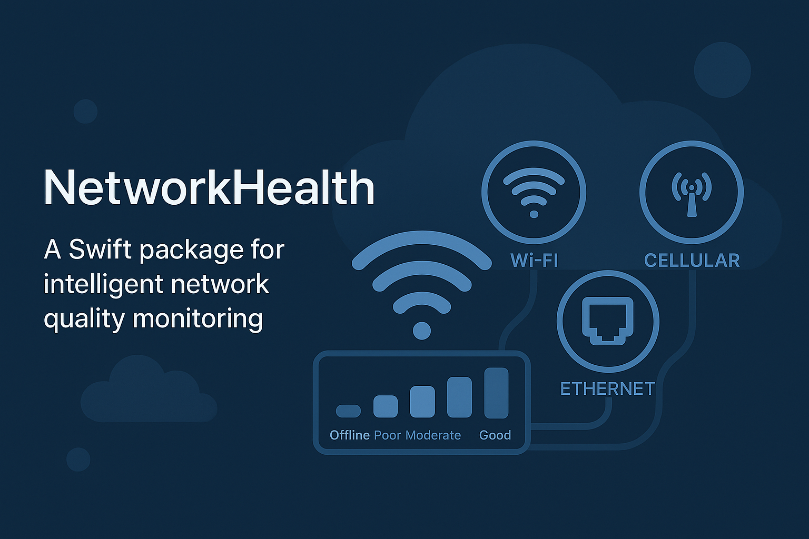

<p align="center">
  
</p>

<h1 align="center">NetworkHealth</h1>

<p align="center">
Swift пакет для интеллектуального мониторинга качества сети с автоматической адаптацией, тестированием скорости и комплексной оценкой качества соединения.
</p>

<p align="center">
  <a href="https://swift.org">
    
  </a>
  <a href="https://swift.org/package-manager/">
    
  </a>
  
  <a href="LICENSE">
    
  </a>
  
</p>

## Обзор

NetworkHealth предоставляет простой и интуитивный API для мониторинга качества сети и адаптации поведения вашего приложения в зависимости от характеристик соединения. Автоматически определяет тип подключения (WiFi, Cellular, Ethernet), измеряет скорость при необходимости и оценивает качество от Offline до Excellent.

## Основные возможности

- 🌐 **Определение типа соединения** - WiFi, Cellular (2G/3G/LTE/5G), Ethernet
- 📊 **Оценка качества** - Пятиуровневая шкала качества (от Offline до Excellent)
- ⚡ **Тестирование скорости** - Опциональная интеграция со SpeedTestCore
- 📈 **Непрерывный мониторинг** - Обновления состояния сети в реальном времени через AsyncStream
- 🎯 **Требования операций** - Предопределенные проверки для типичных операций
- 💾 **История измерений** - Автоматическое сохранение снимков и статистика
- 🔄 **Интеграция со SwiftUI** - Observable обертка для бесшовного обновления UI
- 🧵 **Потокобезопасность** - Архитектура на основе Actor для безопасной конкурентности

## Быстрый старт

### Установка

Добавьте NetworkHealth в ваш `Package.swift`:

```swift
dependencies: [
    .package(url: "https://github.com/yourusername/NetworkHealth.git", from: "1.0.0")
]
```

### Базовое использование

#### 1. Snapshot - Быстрая проверка

```swift
import NetworkHealth

// Простая проверка качества
let snapshot = await NetworkHealth.snapshot()

if snapshot.isGoodQuality {
    startDownload()
} else {
    showLowQualityWarning()
}
```

#### 2. Stream - Непрерывный мониторинг

```swift
// Мониторинг в реальном времени
for await state in NetworkHealth.stream() {
    print("Качество: \(state.quality)")

    if state.isDegradedQuality {
        adaptUIForLowQuality()
    }
}
```

#### 3. Observable - Интеграция со SwiftUI

```swift
struct NetworkStatusView: View {
    @State private var health = NetworkHealth.observable()

    var body: some View {
        HStack {
            Circle()
                .fill(health.isOnline ? .green : .red)
                .frame(width: 10)
            Text(health.currentQuality.description)
        }
    }
}
```

#### 4. Health Check - Контроль операций

```swift
// Проверка соответствия требованиям
if await NetworkHealth.isGoodEnoughFor(.videoStreaming) {
    startVideoPlayer()
} else {
    showBufferingWarning()
}
```

## Уровни качества

| Уровень | Описание | Сценарии использования |
|---------|----------|------------------------|
| **Offline** | Нет соединения | Офлайн режим, только кэш |
| **Poor** | 2G, нестабильный 3G | Текстовые сообщения, минимум данных |
| **Moderate** | 3G, слабый LTE | Изображения, ленты соцсетей |
| **Good** | LTE, 5G, хороший WiFi | Видео стриминг, видеозвонки |
| **Excellent** | Быстрый WiFi, Ethernet | HD видео, загрузка больших файлов |

## Примеры использования

### Адаптивная загрузка контента

```swift
let snapshot = await NetworkHealth.snapshot()

switch snapshot.quality {
case .offline:
    showOfflineContent()
case .poor:
    loadTextOnly()
case .moderate:
    loadImagesWithCompression()
case .good, .excellent:
    loadFullResolutionContent()
}
```

### Менеджер загрузок

```swift
actor DownloadManager {
    func scheduleDownload(_ file: File) async {
        switch file.priority {
        case .high:
            // Запустить немедленно, если есть соединение
            if await NetworkHealth.isGoodEnoughFor(.basicBrowsing) {
                startDownload(file)
            }
        case .normal:
            // Дождаться хорошего соединения
            if await NetworkHealth.isGoodEnoughFor(.largeDownload) {
                startDownload(file)
            }
        }
    }
}
```

## Тестирование скорости (опционально)

```swift
import SpeedTestCore

// Stream с автоматическими тестами скорости
for await state in NetworkHealth.stream(
    includeSpeedTests: true,
    speedTestInterval: 60,
    networkProvider: myNetworkProvider
) {
    if let speed = state.downloadSpeedMbps {
        print("Скорость загрузки: \(speed) Мбит/с")
    }
}
```

## Документация

- 📖 [Краткое руководство](QUICK_START.md)
- 🇷🇺 [Подробная документация (RU)](Docs/ru/README.md)
- 📚 [Detailed Documentation (EN)](Docs/en/README.md)

## Требования

- iOS 15.0+
- Swift 5.9+
- Xcode 15.0+

## Лицензия

NetworkHealth доступен под лицензией MIT. Подробности в файле LICENSE.

## Вклад в проект

Мы приветствуем ваш вклад! Не стесняйтесь отправлять Pull Request.
